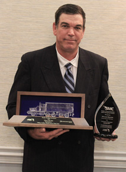

Dennis Rollins from the Jacksonville terminal was named the Florida Trucking Association&rsquo;s Driver of the Year at its Annual Safety Management Council&rsquo;s awards dinner on June 17th in Daytona Beach for his 32 years of safe driving on over 2 million miles.

Dennis has competed in the Florida TDC for several years now, and he has been named Driver of the Quarter multiple times. He is also a past recipient of the Florida Driver of the Month and the National Safety Council for his professionalism.

In his off-time, he works with his church youth program and is also involved with its Sunday School program. In the past, he's built homes for needy families through a local chapter of Habitat for Humanity.

Dennis and his wife Susan will be invited to attend the FTA Annual Conference to be held in Hollywood, Florida in August to be recognized by the general membership.

<iframe allowfullscreen="" frameborder="0" height="315" src="http://www.youtube.com/embed/IuJqaIU62sU?rel=0" width="560"></iframe>
