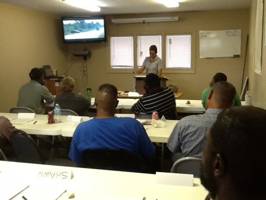

{:style="width: 275px; margin: 5px; float: left;"}We strongly believe that the ability to operate safely and to succeed depends on quality training. Drivers for Florida Rock &amp; Tank Lines participate in a comprehensive training program, beginning with field training in the particular products you will be transporting. Field training is a hands-on education conducted by a certified driver trainer during two to four weeks. Here, drivers learn the various procedures involving loading, unloading and equipment operation of the tank trailer. The driver trainer also assesses trainees&rsquo; skills as a professional driver during this time.

In addition to the field training, drivers attend our three-day Driver Training School during the first 90 days of employment. This classroom-style training is instructed by our Safety Department. During the three days, drivers receive training in HM126f (hazardous materials), HM232 (security), defensive driving, hours of service, loading and unloading procedures, rollover prevention and other relevant subjects. Regardless of experience in the trucking industry, all drivers will find this class both useful and comprehensive.

---

Drivers also receive ongoing training on various subjects during each terminal&#39;s standard safety meetings. These safety meetings are held at varying times throughout the day to allow drivers on all shifts to be able to attend.

Based on the feedback we&rsquo;ve received from our drivers, no matter what their previous experience, we&rsquo;re confident our training program is one of the best in the industry.

---

{:width="450px" }
