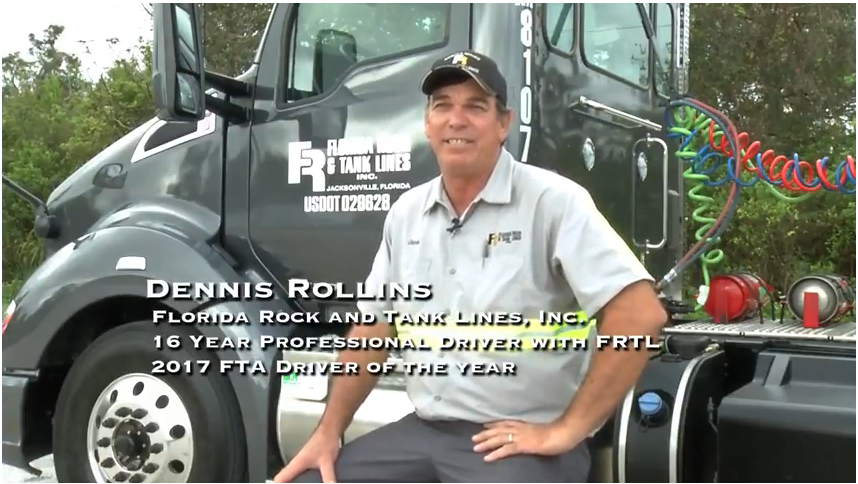

# Committed to Excellence

---

Florida Rock & Tank Lines, Inc., strives to be recognized for both the safety and quality of our service and staff. Our mission is to safely deliver our customers' products on-time and accurately. Throughout our community of customers, employees and affiliates, we create an atmosphere of safety, trust, honesty and integrity, that distinguishes us.

For our customers, we endeavor every day to improve the services we provide through constant innovation and by continuously improving quality, safety and productivity. We also aim to provide the highest level of customer satisfaction and meet individual requirements and needs. For employees, we offer opportunities, training and encouragement to achieve career objectives. These principles provide a set of standards, which guide individual actions and major policy decisions.

*As published in Bulk Transporter Magazine*

Florida Rock & Tank Lines, Inc. scored a notable milestone by winning its first Outstanding Performance Trophy in the National Tank Truck Carriers (NTTC) 2011 Tank Truck Safety Contest. The Jacksonville, Florida based carrier did so with a frequency of .340. The Florida Rock &amp; Tank Lines achievement comes at a time when the cumulative tank truck accident frequency is at a 10-year low. The carrier competed in the 35-55 Million Miles Class and was selected out of a group of 23 tank truck fleets that won the Grand Award in their respective mileage categories for the 2011 calendar year. In addition to the Outstanding Performance Trophy, Florida Rock &amp; Tank Lines is taking home a Grand Award in the Competitive Safety Contest and an Honor Award in the Personnel Safety Contest. The carrier also earned a fifth year improvement award. [(click here to read entire article)](about-us-awards.html)

[{:width="250px"}](about-us-awards.html)

---

[Dennis Rollins - Florida Trucking Association Driver of the Year](driver-of-the-year-dennis-rollins.html)

*Click link or image to view video*
